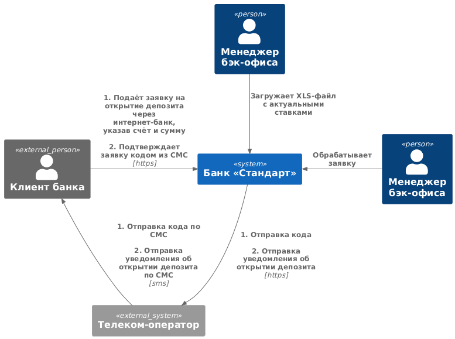
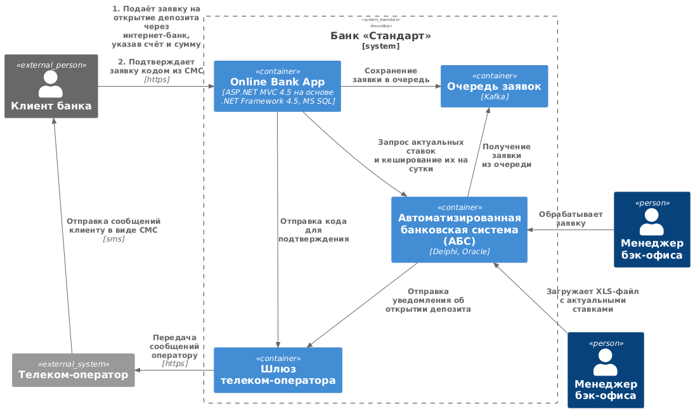

### Название задачи: Открытие депозитов онлайн MVP

Добавить возможность открытия депозита через сайт банка для новых клиентов или через интернет-банк для существующих
клиентов.

### Автор: Serg G

### Дата: 03.05.2025

### Функциональные требования

| **№** | **Действующие лица или системы** | **Use Case**                                  | **Описание**                                                                      |
|:-----:|:---------------------------------|:----------------------------------------------|:----------------------------------------------------------------------------------|
|  UC1  | Новый клиент, сайт               | Новый клиент оформляет депозит через сайт.    | 1. Новый клиент изучает список доступных депозитов на сайте. (F1)                 |
|       |                                  |                                               | 2. Новый клиент подаёт заявку на депозит, оставив свой номер телефона и ФИО. (F2) |
|       |                                  |                                               | 3. Менеджер кол-центра, изучив заявку, звонит клиенту. (F3)                       |
|       |                                  |                                               | 4. Новый клиент идёт в отделение банка для идентификации. (F4)                    |
|  UC2  | Клиент банка, интернет-банк      | Клиент оформляет депозит через интернет-банк. | 1. Клиент изучает список доступных депозитов в интернет-банке. (F5)               |
|       |                                  |                                               | 2. Клиент подаёт заявку на открытие депозита, указав счёт и сумму. (F6)           |
|       |                                  |                                               | 3. Банк отправляет клиенту СМС с кодом. (F7)                                      |
|       |                                  |                                               | 4. Клиент подтверждает заявку на открытие депозита с помощью кода из СМС. (F7)    |
|       |                                  |                                               | 5. Менеджер бэк-офиса обрабатывает заявку. (F8)                                   |
|       |                                  |                                               | 6. Банк отправляет клиенту СМС об открытии депозита. (F8)                         |
|  UC3  | Менеджер бэк-офиса, АБС          |                                               | 1. Менеджер бэк-офиса загружает в АБС XLS-файл с актуальными ставками. (F9)       |

### Нефункциональные требования

| **№** | **Требование**                                                                                                                                |
|:-----:|:----------------------------------------------------------------------------------------------------------------------------------------------|
|  R1   | Сервисы должны быть доступны в 99,9% случаев.                                                                                                 |
|  R2   | Режим работы сервисов 24/7.                                                                                                                   |
|  R3   | В случае сбоев в ЦОД необходимо, чтобы сервисы были доступны и выдерживали в пике нагрузку в 1000 rps.                                        |
|  P1   | Отклик по всем операциям в интерфейсе должен быть максимально быстрым и занимать миллисекунды.                                                |
|  P2   | Методы API должны выполняться за 100-300 миллисекунд, в некоторых случаях возможно выполнение до 1 секунды.                                   |
|  P3   | Возможность горизонтального масштабирования компонентов                                                                                       |
|  +R1  | Функционал работы с СМС реализовать силами команды разработки банка.                                                                          |
|  +R2  | Исправить долгую загрузку справочных данных при проведении платежей, применить кеширование.                                                   |
|  +R3  | Использовать механизмы шифрования при передаче и хранении данных.                                                                             |
|  +R4  | АБС может масштабироваться только вертикально из-за своей базы данных.                                                                        |
|  +R5  | База данных системы уже перегружена. Онлайн-подача заявок на большое количество продуктов может поставить под угрозу работоспособность банка. |
|  +R6  | Требования по доступности интернет-банка пока невыполнимы.                                                                                    |
|  +R7  | Избежать прямой работы интернет-банка с API АБС в новом процессе, использовать очередь.                                                       |
|  +R8  | Использовать технологии, которые уже есть в банке. Например, базы данных MS SQL и Oracle.                                                     |
|  +R9  | Сразу вести разработку документации для дальнейшего расширения системы.                                                                       |

### Решение

Диаграмма контекста

Диаграмма контейнеров

Исхожу из того, что это MVP и есть необходимость представить рабочее решение с минимальными вложениями, поэтому
оставляем существующий стек и не переделываем глобально текущие решения.

Узким местом во всей системе может быть база данных АБС. База данных уже работает на пределе и не может быть
горизонтально масштабирована. Поэтому отгородим АБС от наплыва заявок с помощью очереди.

### Альтернативы

Альтернативным вариантом может быть отказ от устаревшего стека и переписывание систем с использованием микросервисной
архитектуры. Для такой архитектуры можно на этапе проектирования заложить возможности горизонтального масштабирования,
независимой разработки компонентов, повысить доступность с помощью распределения системы по нескольким ЦОД.

### Недостатки, ограничения, риски

Недостатками текущего решения могут быть невозможность масштабирования и обеспечения необходимой доступности в основном
из-за используемого стека. 
