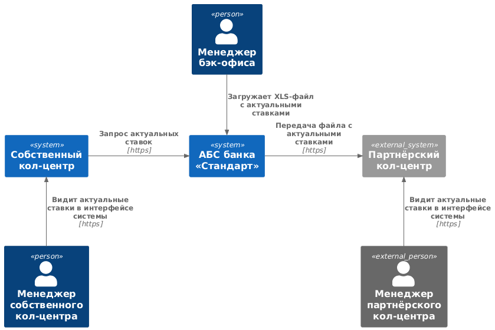
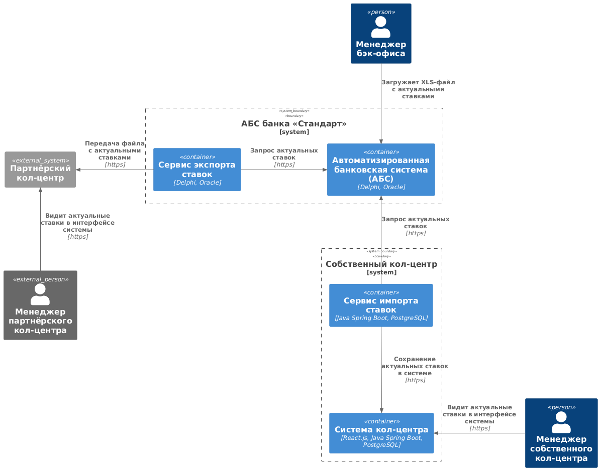

### Название задачи: Открытие депозитов онлайн MVP

Добавить возможность передачи актуальных ставок по депозитам из АБС в собственный и партнёрский кол-центры.

### Автор: Serg G

### Дата: 04.05.2025

### Функциональные требования

| **№** | **Действующие лица или системы** | **Use Case**                                | **Описание**                                                                                                                     |
|:-----:|:---------------------------------|:--------------------------------------------|:---------------------------------------------------------------------------------------------------------------------------------|
|  UC1  | Собственный кол-центр, АБС       | Обновление ставок в собственном кол-центре. | 1. Перед началом рабочего дня в АБС загружены актуальные на сегодня ставки по депозитам. (F1)                                    |
|       |                                  |                                             | 2. Сервис системы кол-центра запрашивает в АБС актуальные ставки и кеширует их на стороне кол-центра на сутки. (F2)              |
|       |                                  |                                             | 3. Менеджер кол-центра во время работы видит актуальные ставки в интерфейсе системы. (F3)                                        |
|  UC2  | Партнёрский кол-центр, АБС,      | Обновление ставок в партнёрском кол-центре. | 1. Перед началом рабочего дня в АБС загружены актуальные на сегодня ставки по депозитам. (F1)                                    |
|       | Сервис экспорта ставок           |                                             | 2. Сервис экспорта ставок запрашивает в АБС актуальные ставки и передаёт их в виде файла в систему партнёрского кол-центра. (F4) |
|       |                                  |                                             | 3. Система партнёрского кол-центра импортирует файл и кеширует ставки на своей стороне на сутки. (F5)                            |
|       |                                  |                                             | 4. Менеджер партнёрского кол-центра во время работы видит актуальные ставки в интерфейсе системы. (F6)                           |

### Нефункциональные требования

| **№** | **Требование**                                                                                                |
|:-----:|:--------------------------------------------------------------------------------------------------------------|
|  R1   | Сервисы должны быть доступны в 99,9% случаев.                                                                 |
|  R2   | Режим работы сервисов 24/7.                                                                                   |
|  R3   | В системах кол-центров на начало рабочего дня должны быть актуальные ставки по депозитам.                     |
|  P1   | Процесс актуализации ставок должен быть быстрым и занимать секунды.                                           |
|  +R1  | Запускать процесс актуализации ставок автоматически в системах кол-центров в начале рабочего дня.             |
|  +R2  | Предусмотреть информирование ответственных, если выполнить актуализацию не удалось.                           |
|  +R3  | Предусмотреть возможность запуска процесса актуализации ставок в ручном режиме, если автоматика не сработала. |
|  +R4  | Использовать механизмы шифрования при передаче данных.                                                        |
|  +R5  | Описать в документации формат передачи данных.                                                                |

### Решение

Диаграмма контекста

Диаграмма контейнеров

Исхожу из того, что это MVP и есть необходимость представить рабочее решение с минимальными вложениями. Ставки
рассчитываются менеджерами бэк-офиса ежедневно, как и ранее. Перед началом рабочего дня менеджер загружает в АБС
актуальный файл со ставками. Системы кол-центров получают актуальные данные по крону.

### Альтернативы

Альтернативным вариантом может быть перенос функций расчёта ставок и автоматическое формирование персональных
предложений в АБС. При этом можно организовать получение этой информации системами кол-центров непосредственно в момент
обращения клиента.

### Недостатки, ограничения, риски

Недостатками текущего решения может быть невозможность получать менеджерами кол-центров информации о персональных
условиях по ставкам.
